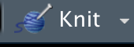

```{r setup, include=FALSE}
options(htmltools.dir.version = FALSE)
```

```{r xaringan-themer, include=FALSE, warning=FALSE}
library(xaringanthemer)
style_mono_accent(
  base_color = "#09274B",
  base_font_size = "32px", 
  header_h1_font_size = "2.0rem",
  header_h2_font_size = "1.5rem",
  header_h3_font_size = "1.25rem", 
  header_background_content_padding_top = "2rem", 
  header_font_google = google_font("Lato"),
  text_font_google   = google_font("Montserrat", "300", "300i", "500"),
  code_font_google   = google_font("Source Code Pro", "300", "500"), 
  extra_css = list("p" = list("margin-block-start" = "0.5em", 
                              "margin-block-end" = "0.5em"), 
                   "ul" = list("margin-block-start" = "0.5em", 
                              "margin-block-end" = "0.5em"), 
                   "li" = list("margin-block-start" = "0.5em", 
                              "margin-block-end" = "0.5em"), 
                   "pre" = list("margin-top" = "0.5em", 
                              "margin-bottom" = "0.5em", 
                              "white-space" = "pre-wrap"),
                   ".small" = list("font-size" = "80%")), 
  link_color = "#339944"
)
```
class: inverse, center, middle

# `r desc::desc_get('Title', '..')`
### `r rmarkdown::metadata$author`
### `r rmarkdown::metadata$institute`
### (updated: `r Sys.Date()`)

---
# Motivations

Challenges when writing a paper:
* syncing results with text  
  e.g. p-values, number of data points, figures, data tables
* formatting bibliographies for different journals

---

# Learning Objectives

`r gsub("\n ", "\n", desc::desc_get("learningOutcomes"))`

---
class: inverse, center, middle

# Reproducible Documents

---

# Overview

Reproducible Documents:

* a way to write reports that embed text with other outputs:
  - code, figures, tables
* authors only make changes in *one* place
  - the entire document stays up to date
  - (instead of redoing an analysis, and copying images and numbers into a separate file)

---

# Many Platforms Exist for Reproducible Documents:

* [Manubot](https://github.com/manubot/rootstock)
* [Stencila](https://stencila.io/)
* [Jupyter Notebooks](https://jupyter.org/)
* [Curvenote](https://curvenote.com/)
* [Overleaf](https://www.overleaf.com/edu/ufl)

--

### This lesson is a basic intro to [R Markdown](https://rmarkdown.rstudio.com/) !
(many add-ons extend functionality)

---
class: inverse, center, middle

# How R Markdown Works

---

# R Markdown Toolchain

* **`rmarkdown`** is the file-format and main interface with R (`*.Rmd`)
* **`knitr`** runs code and formats results into markdown
* **`pandoc`** converts markdown documents into other formats

---

# Installation

* RStudio comes with `pandoc`.
  - but it can be [installed separately](https://pandoc.org/installing.html), as well.
* The **`rmarkdown`** package includes **`knitr`** as a dependency.

--

For PDF output, you also need LaTeX. The [**`tinytex`** package](https://yihui.org/tinytex/) provides a mechanism for a lightweight LaTeX install:
```{r, eval = FALSE}
tinytex::install_tinytex()
```

---

# Creating Documents

1. Create an R Markdown document.
  - Use the `New R Markdown` file option in RStudio, or create a plaintext file.
2. Run the R code
```{r, eval = FALSE}
rmarkdown::render({document.Rmd})
```
.center[**OR**]
  Use the `Knit` button in RStudio.

```{r, echo = FALSE, fig.alt = "A screenshot of the Knit button in RStudio, which appears as an image of a ball of yarn with a needle in it, next to the text 'Knit' and an optional pulldown menu in the form of a down arrow."}

```

---
# What happens during knitting?

1. **`knitr`** runs the code chunks and merges the output back into a markdown file.
2. `pandoc` converts the markdown into the final output format(s).

```{r, echo = FALSE, fig.alt = "A diagram from https://rmarkdown.rstudio.com/lesson-2.html, showing the workflow for R Markdown, where an Rmd file is transformed by `knitr` into a markdown file, and then by `pandoc` into multiple output files."}
knitr::include_graphics("rmarkdownflow.png")
```

---
class: inverse, center, middle

# Markdown

---
# About Markdown

Markdown is a **markup** language.

* Unlike MS Word or Google Docs, where you apply formatting to the text directly;

* In **markdown**, you write out the formatting in the text.  
  The text file is then processed to produce a formatted document.

---

# Markdown Formatting

Markdown has an intentionally limited set of formatting commands:
* formatting is easy to read in plaintext
* you can use any text editor
* works well with version control
* lets you focus on content;  
  styling can be customized for the output format

---

# Syntax: Headings

```
# heading 1
## heading 2
### heading 3
```
.center[*renders into*]

# heading 1
## heading 2
### heading 3

---

# Syntax: bullets

```
- bullet list
  * sub-item
1. numbered list
1. numbered list
```
.center[*renders into*]

- bullet list
  + sub-item
1. numbered list
1. numbered list
---

# Syntax: text

```
 **bold**, __bold__
 *italic*, _italic_
 > This is a quote.
```
.center[*renders into*]

 **bold**, __bold__
 
 *italic*, _italic_
 
 > This is a quote
 
---

# Links

```
Raw URLs:
https://cran.r-project.org/

Formatted links:
[CRAN](https://cran.r-project.org/)
```
.center[*renders into*]

Raw URLs:
https://cran.r-project.org/

Formatted links:
[CRAN](https://cran.r-project.org/)

---
class: inverse, center, middle

# R Markdown

---
# What does R Markdown add?

**R Markdown** adds additional syntax for authoring code-based reports.
* document metadata
* code chunks
* references

---
# Header Information

R Markdown files begin with a header:
```{yaml}
---
title: "An example document"
author: "Natya Hans"
output: html_document
---
```

* metadata about the document will be incorporated in the final output

---
# A More Complex Header
```{yaml}
---
title: "Chaotic Dynamics"
author:
- "Natya Hans"
- "Gritty"
output:
  html_document:
    toc: true
    toc_depth: 2
---
```

---

# Code Chunks

Unexecuted code can be marked with triple backticks  
(the backtick is **not** the same as a single-quote!)

````
```
print("Hello World!")
```
````

.center[*renders into*]

```
print("Hello World!")
```

---

# Inserting Code

Including `{r}` will execute the code in R and display the result:

````
```{r}`r ''`
1 + 1
```
````
.center[*renders into*]

```{r}
1 + 1
```

---
# Code Chunk Options

The evaluation of code chunks can be controlled through options, e.g.:
````
```{r, eval = FALSE}`r ''`
1 + 1
```
````
.center[*renders into*]

```{r, eval = FALSE}
1 + 1
```

See the description of [chunk options](https://yihui.org/knitr/options/) for details.

---
# Inline code

Code expressions can be embedded inline with text, too.

````
The square root of 10 is `r`r ''` sqrt(10)`.
Today's date is `r`r ''` Sys.Date()`.
````
.center[*renders into*]

The square root of 10 is `r sqrt(10)`.

Today's date is `r Sys.Date()`.

---
# Other Coding Languages

**`knitr`** supports other programming languages.
See [Section 2.7](https://bookdown.org/yihui/rmarkdown/language-engines.html) of the R Markdown book for details.

---
# Tables (markdown)

```
| Tables       | Are           | Cool  |
|:-------------|:-------------:|------:|
| col 1 is     | left-aligned  | $1600 |
| col 2 is     | centered      |   $12 |
| col 3 is     | right aligned |    $1 |
```
.center[*renders into*]

| Tables       | Are           | Cool  |
|:-------------|:-------------:|------:|
| col 1 is     | left-aligned  | $1600 |
| col 2 is     | centered      |   $12 |
| col 3 is     | right aligned |    $1 |

---
# Tables (R code)

````
```{r, results="asis"}`r ''`
knitr::kable(mtcars[1:4,1:3], 
             format = "markdown")
```
````
.center[*renders into*]

```{r, results="asis", echo = FALSE}
knitr::kable(mtcars[1:4,1:3], format = "markdown")
```
---
# Figures (images)

```

```


---

# Figures (code)

```{r, out.height=400, out.width = 400, fig.alt="A scatterplot of mileage (mpg) vs. engine displacement (disp) from the mtcars dataset. There is a general inverse relationship (curvilinear, with a hint of being concave-up) with higher displacement corresponding to lower mileage. Displacement on the x-axis ranges from 71.1 to 472 (cubic centimeters?) and mileage on the y-axis ranges from 10.4 to 33.9 (miles per gallon)."}
plot(mpg ~ disp, data = mtcars, 
     cex = 2, cex.lab = 2, cex.axis = 2)
```

---

# References

* Get your citations into a `.bib` format. (plain-text bibtex, most reference managers can output a list in this way)
* Add metadata to the header about the file and the *style* of citations
* Insert citations using `[@{bibentry}]`, where `{bibentry}` is the unique identifier for the reference in the bibliography.
  - the [`citr` add-in](https://github.com/crsh/citr) also lets you search for the correct `{bibentry}`

---

# Example .bib file

contents of `refs.bib` file:
```
@article{Barkai_1988,
	Author = {Amos Barkai and Christopher McQuaid},
	Journal = {Science},
	Number = {4875},
	Pages = {62-64},
	Title = {Predator-prey role reversal in a marine benthic ecosystem},
	Volume = {242},
	Year = {1988}}
```

---

# Example YAML header

```{yaml}
---
title: "An example document"
author: "Natya Hans"
output: html_document
bibliography: refs.bib
csl: methods-in-ecology-and-evolution.csl
---
```

Find Citation Style Language (CSL) files at
* https://github.com/citation-style-language/styles
* https://www.zotero.org/styles

---

# Example citation

```
Sometimes whelks eat lobsters [@Barkai_1998].
```

.center[*renders into*]

```{r, echo = FALSE, results="asis", message = FALSE}
library(RefManageR)
BibOptions(check.entries = FALSE,
           bib.style = "authoryear",
           cite.style = "alphabetic",
           style = "markdown",
           hyperlink = FALSE,
           dashed = FALSE)
myBib <- ReadBib("refs.bib", check = FALSE)
cat("Sometimes whelks eat lobsters ", 
    Citep(myBib, .opts = list(cite.style = "authoryear")), 
    ".", sep = "")
cat("\n\n")
cat("### References\n\n")
cat("1. ")
PrintBibliography(myBib)
```

---
class: inverse, center, middle

# Extensions

---
# Basic Output Formats

* `html_document` - a single HTML file
* `pdf_document` - a single PDF file (requires a LaTeX installation, see the [**`tinytex`** package](https://yihui.org/tinytex/))
* `word_document` - a single MS Word file
* `github_document` - markdown for rendering in GitHub

---
# Other Formats

MANY packages build on R Markdown to do more complex things:
* [thesisdown](https://github.com/ismayc/thesisdown) has thesis templates
* [blogdown](https://bookdown.org/yihui/blogdown/) for websites
* [xaringan](https://github.com/yihui/xaringan) for interactive slides  
  (what this uses)

---

# Thanks

* Let me know what content you'd like to see
* Contact me for additional questions or consultation requests!
* Check back in on the libguide for more modules and contact info:
  - https://guides.uflib.ufl.edu/reproducibility

