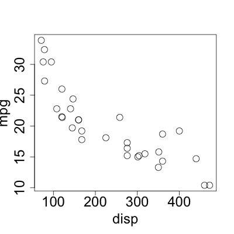

# Syllabus

* Learning Objectives
  + describe the principles of reproducible documents
  + apply markdown syntax to format text
  + format numerical results in R Markdown
  + format tables in R Markdown
  + generate figures in R Markdown
  + format references in R Markdown

## Reproducible Documents

* Overview

  Reproducible Documents:
  + a way to write reports that embed text with other outputs:
    - code, figures, tables
  + authors only make changes in *one* place
    - the entire document stays up to date
    - (instead of redoing an analysis, and copying images and numbers into a separate file)
* Many Platforms Exist:
  + [Manubot](https://github.com/manubot/rootstock)
  + [Stencila](https://stenci.la/)
  + [Jupyter Notebooks](https://jupyter.org/)
  **This lesson is a basic intro to [R Markdown](https://rmarkdown.rstudio.com/) !
(many add-ons exist that extend functionality)**

## How R Markdown Works

* R Markdown Tools
  + **`rmarkdown`** is the file-format and main interface with R (`*.Rmd`)
  + **`knitr`** is the underlying engine that runs code
  + `pandoc` is a software tool that converts markdown documents into other formats

* Installation
  + RStudio comes with `pandoc`.
    - but it can be [installed separately](https://pandoc.org/installing.html), as well.
  + The **`rmarkdown`** package includes **`knitr`** as a dependency.
  For PDF output, you will want LaTeX. The [**`tinytex`** package](https://yihui.org/tinytex/) provides a mechanism for a lightweight LaTeX install:
    ```r
    tinytex::install_tinytex()
    ```
* Creating Documents
  1. Create an R Markdown document.
      - Use the `New R Markdown` file option in RStudio, or create a plaintext file.
  2. Run the R code
     ```r
     rmarkdown::render({document.Rmd})
     ```
     **OR**
     
     Use the `Knit` button in RStudio.

     
* What happens during knitting?

  For a given `document.Rmd`
  1. **`knitr`** runs the code chunks and merges the output with the remainder of `document.Rmd` into a markdown file: `document.md`
  2. `pandoc` converts the markdown into the final outputs.
  
## Syntax

* Basic Structure

  R Markdown files begin with a header:
  ```yaml
  ---
  title: "An example document"
  author: "Hao Ye"
  output: html_document
  ---
  ```
  + this specifies metadata about the document that gets incorporated in the final output
* A More Complex Header
  ```yaml
  ---
  title: "Chaotic Dynamics"
  author:
  - "Hao Ye"
  - "Gritty"
  output:
    html_document:
      toc: true
      toc_depth: 2
  ---
  ```
* Syntax: Headings
  ```
  # heading 1
  ## heading 2
  ### heading 3
  ```
  *renders into*
  
  # heading 1
  ## heading 2
  ### heading 3

* Syntax: bullets
  ```
  - bullet list
      + sub-item
  1. numbered list
  1. numbered list
  ```
  *renders into*

  - bullet list
    + sub-item
  1. numbered list
  1. numbered list

* Syntax: text
  ```
   **bold**, __bold__
   *italic*, _italic_
   > This is a quote.
  ```
  *renders into*

   **bold**, __bold__
   
   *italic*, _italic_
   
   > This is a quote

* Links
  ```
  Raw URLs:
  https://cran.r-project.org/
  
  And formatted links:
  [CRAN](https://cran.r-project.org/)
  ```
  *renders into*

  Raw URLs:
  https://cran.r-project.org/
  
  And formatted links:
  [CRAN](https://cran.r-project.org/)

## Code Chunks

* Inserting Code

  ````
  ```{r}
  1 + 1
  ```
  ````
  *renders into*

  ```r
  1 + 1
  ```
  ```
  ## [1] 2
  ```

* Code Chunk Options

  The evaluation of code chunks can be controlled through options, e.g.:
  ````
  ```{r, eval = FALSE}
  1 + 1
  ```
  ````
  *renders into*

  ```
  1 + 1
  ```

  See the description of [chunk options](https://yihui.org/knitr/options/) for details.

* Inline code
  ````
  The square root of 10 is `r sqrt(10)`.
  Today's date is `r Sys.Date()`.
  ````
  *renders into*

  The square root of 10 is 3.1622777.
  
  Today's date is 2020-07-23.

* Other Coding Languages

  **`knitr`** supports other programming languages.
  
  See [Section 2.7](https://bookdown.org/yihui/rmarkdown/language-engines.html) of the R Markdown book for details.

* Tables (markdown)

  ```
  | Tables        | Are           | Cool  |
  | ------------- |:-------------:| -----:|
  | col 3 is      | right-aligned | $1600 |
  | col 2 is      | centered      |   $12 |
  | zebra stripes | are neat      |    $1 |
  ```
  *renders into*

  | Tables        | Are           | Cool  |
  | ------------- |:-------------:| -----:|
  | col 3 is      | right-aligned | $1600 |
  | col 2 is      | centered      |   $12 |
  | zebra stripes | are neat      |    $1 |


* Tables (R code)

  ````
  ```{r, results="asis"}
  knitr::kable(mtcars[1:4,1:3], 
               format = "markdown")
  ```
  ````
  *renders into*

  |               |  mpg| cyl| disp|
  |:--------------|----:|---:|----:|
  |Mazda RX4      | 21.0|   6|  160|
  |Mazda RX4 Wag  | 21.0|   6|  160|
  |Datsun 710     | 22.8|   4|  108|
  |Hornet 4 Drive | 21.4|   6|  258|


* Figures (images)
  ```
  
  ```

  

* Figures (code)
  ```
  plot(mpg ~ disp, data = mtcars, 
       cex = 2, cex.lab = 2, cex.axis = 2)
  ```

  

* References
  + Get your citations into a `.bib` format. (plain-text bibtex, most reference managers can output a list in this way)
  + Add metadata to the header about the file and the *style* of citations
  + Insert citations using `[@{bibentry}]`, where `{bibentry}` is the unique identifier for the reference in the bibliography.
    - see also the [`citr` add-in](https://github.com/crsh/citr).
* References (`.bib`)
  `refs.bib`:
  ```
  @article{Barkai_1988,
  	Author = {Amos Barkai and Christopher McQuaid},
  	Journal = {Science},
  	Number = {4875},
  	Pages = {62-64},
  	Title = {Predator-prey role reversal in a marine benthic ecosystem},
  	Volume = {242},
  	Year = {1988}}
  ```
* References (YAML header)
  ```{yaml}
  ---
  title: "An example document"
  author: "Hao Ye"
  output: html_document
  bibliography: refs.bib
  csl: methods-in-ecology-and-evolution.csl
  ---
  ```
  Find Citation Style Language (CSL) files at
  + https://github.com/citation-style-language/styles
  + https://www.zotero.org/styles

* References (usage)
  ```
  Sometimes whelks eat lobsters [@Barkai_1998].
  ```
  *renders into*

  Sometimes whelks eat lobsters (Barkai and McQuaid, 1988).
  
  ### References
  
  1. Barkai, A. and C. McQuaid (1988). "Predator-prey role reversal in a marine benthic ecosystem". In: *Science* 242.4875, pp. 62-64.

## Extensions

* Basic Output Formats
  + `html_document` - a single HTML file
  + `pdf_document` - a single PDF file (requires a LaTeX installation, see the [**`tinytex`** package](https://yihui.org/tinytex/))
  + `word_document` - a single MS Word file
  + `github_document` - markdown for rendering in GitHub
* Other Formats
  MANY packages build on R Markdown to do more complex things:
  + [thesisdown](https://github.com/ismayc/thesisdown) has thesis templates
  + [blogdown](https://bookdown.org/yihui/blogdown/) for websites
  + [xaringan](https://github.com/yihui/xaringan) for interactive slides  
  (what this uses)
* Thanks
  + Let me know what content you'd like to see
  + Contact me for additional questions or consultation requests!
  + Check back in on the libguide for more modules and contact info:
    - https://guides.uflib.ufl.edu/reproducibility

